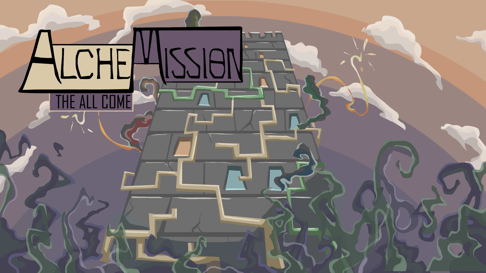

# Alchemission - The All Came
Create and research alchemystic materials in your own tower. Sounds very cosy, but unfortunately you're under constant siege from gruelsome creatures. Use your powerful know-how in the field of alchemy to defend your tower. Get help from a nearby plumber to do so! Get a friend of you to play the "Alchemission - The Mischen" and send you TRANSMISSIONS of ingredients for your alchemic endeavours. And send screaming verbal TRANSMISSIONS his way if the mission proofs impossible.

This project was originally created during an 48h jam called Global Game Jam 2018:
* [Alchemission - The All Came](https://globalgamejam.org/2018/games/alchemission-all-come)
* [Alchemission - Mischen](https://globalgamejam.org/2018/games/alchemission-mischen)

Downloads of the Game can be found here: [Releases](https://github.com/TheJP/GlobalGameJam2018Alchemy/releases)
